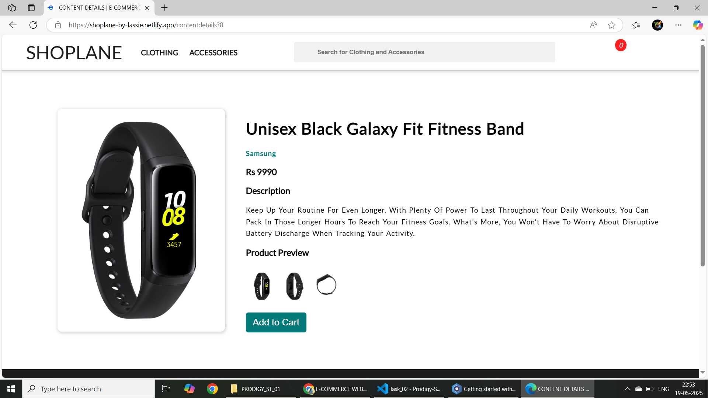
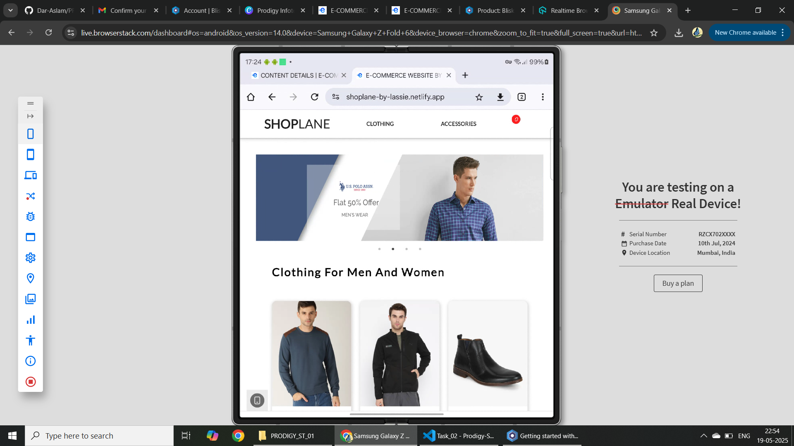
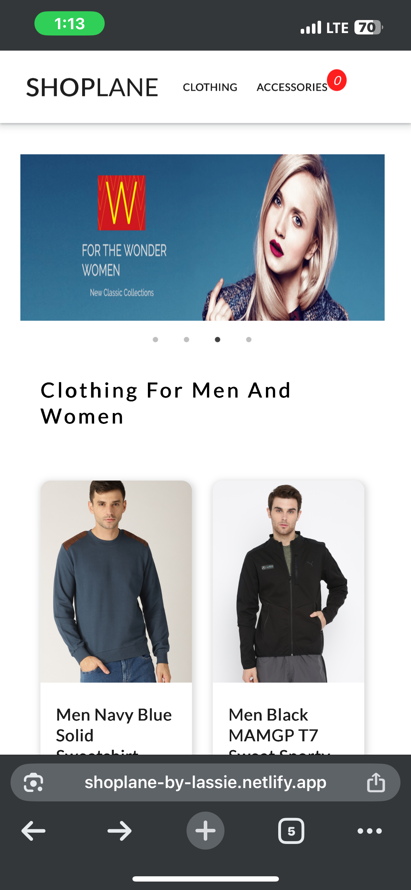
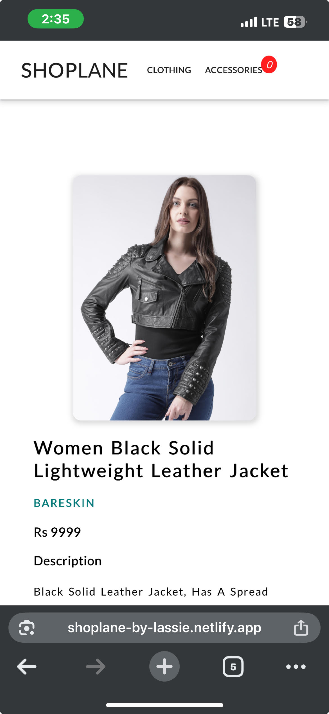

# Cross-Browser & Cross-Device Compatibility Test Report  
**Website:** [Shoplane by Lassie](https://shoplane-by-lassie.netlify.app/)  

---

## **Test Environments**  
| **Device/OS**        | **Browsers Tested**                |  
|----------------------|------------------------------------|  
| **Desktop (Windows)** | Chrome, Firefox, Edge              |  
| **Desktop (macOS)**   | Chrome, Firefox, Safari, Edge      |  
| **Tablet (Android)**  | Chrome, Firefox, Edge              |  
| **Mobile (Android)**  | Chrome, Firefox, Edge              |  
| **iPad (iOS)**        | Safari, Chrome, Edge               |  
| **iPhone (iOS)**      | Safari, Chrome, Edge               |  

---

## **1. Desktop - Windows**  
### **Chrome (v136)**  
- **Layout:** Fully responsive, no overflow issues  
- **Links:** All navigation links work correctly (Home, About, Products, Contact)  
- **Functionality:** "Add to Cart" and form submission features operate as expected  
*Screenshot:* 

### **Firefox (v138)**  
- **Layout:** Same as Chrome  
- **Minor Issue:** Headings appear slightly bolder  
*Screenshot:*   

### **Edge (v136)**  
- **Identical to Chrome** — no visual or functional issues found 
*Screenshot:* 

---

## **2. Desktop - macOS**  
### **Safari (v17)**  
- **Layout:** Proper rendering across all sections  
- **Minor Issue:** Slight (0.2s) delay in hover animations  
  

### **Chrome, Firefox, Edge**  
- Behaves the same as on Windows  

---

## **3. Tablet - Android (Samsung Galaxy Tab S8)**  
### **Chrome, Firefox, Edge**  
- **Layout:** Responsive in both portrait and landscape modes  
- **Issue:** Footer icons appear too small in portrait orientation  
  

---

## **4. Mobile - Android (samsung z fold)**  
### **Chrome**  
- **Navigation:** Hamburger menu opens and closes properly  
- **Issue:** "Add to Cart" button text wraps into two lines on narrow screens  
*Screenshot:* 

### **Firefox, Edge**  
- Same as Chrome  
- **Additional:** Firefox has slightly slower JavaScript loading  

---

## **5. iPad - iOS (iPad Air, iOS 17)**  
### **Safari**  
- **Touch Controls:** All buttons and links respond properly  
- **Issue:** Extra whitespace appears in the header when in landscape mode  
  

### **Chrome, Edge**  
- No additional issues found  

---

## **6. iPhone - iOS (iPhone 13, iOS 18)**  
### **Safari**  
- **Mobile Menu:** Opens smoothly with animation  
- **Issue:** Product images flicker occasionally during scroll  
*Screenshot:* 
### **Chrome, Edge**  
- **No flickering observed**  
*screenshot:* 
---

## **Critical Issues Summary**  
| **Issue**                   | **Device/Browser**         | **Priority** |  
|-----------------------------|----------------------------|--------------|  
| Font-weight inconsistency   | Firefox (Windows/macOS)    | Low          |  
| Footer icon compression     | Android Tablet             | Medium       |  
| Button text wrapping        | Android Mobile             | High         |  
| Image flickering on scroll  | iPhone Safari              | High         |  

---

## **Recommendations**

1. **Button Text Wrapping (Android Mobile)**  
   The "Add to Cart" button text wraps into two lines on smaller screens. Recommend reducing the font size or adjusting padding to keep the text on one line.

2. **Footer Icon Size (Android Tablet)**  
   Footer icons appear too small in portrait mode. Suggest increasing the icon size or adding spacing to improve visibility.

3. **Image Flickering (iPhone Safari)**  
   Product images flicker during scroll on iPhone Safari. Recommend optimizing image rendering or reviewing scroll-related styles to prevent this behavior.

4. **Font-Weight Inconsistency (Firefox Desktop)**  
   Headings appear slightly bolder in Firefox compared to other browsers. Recommend checking font-weight settings and ensuring consistent fonts are used across browsers.

5. **Header Whitespace (iPad Landscape Mode)**  
   Excessive whitespace appears in the header on iPad when in landscape mode. Suggest reducing top/bottom padding or adjusting the layout for landscape orientation.

6. **Hover Animation Delay (Safari macOS)**  
   There is a slight delay in hover animations. Recommend checking animation timing settings to make them more responsive across all browsers.

***

# Cross-Browser Testing Tools Used

## 1. Developer Tools
- **Chrome DevTools** 
- **Firefox Developer Tools** 
- **Safari Web Inspector** (Enabled via: Safari → Preferences → Advanced → Show Develop menu)

## 2. Cloud Testing
- **BrowserStack** (Free tier)
- **Responsinator.com**

## 3. Physical Test Devices

